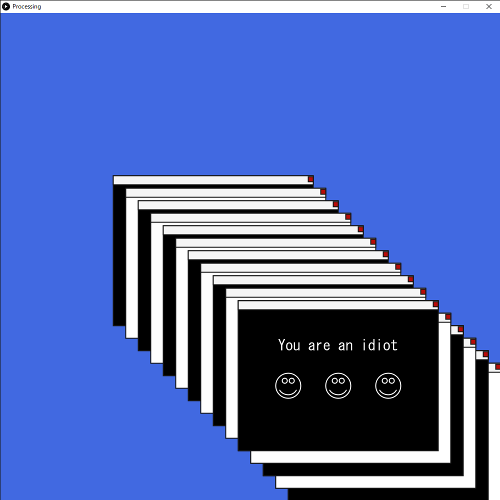

# あの有名なブラクラをProcessingで表面上の動きのみ再現
## 概要
デモ画像のように、懐かしいアレを再現したものです。
本家同様、画面の点滅が激しいので気をつけてください。
音声は自分で用意してください。
## 使用方法 
- Processingをインストール
- minimを予めインストール
- idiot.mp3をprocessing.pdeと同じ階層に用意する

## デモ

## 追記
pdeファイルを見てもらえればわかると思うのですが、無限ウインドウの動きをするだけで破壊活動、情報抜き出しなどは一切しておりません。

## ライセンス
MIT LICENSE
